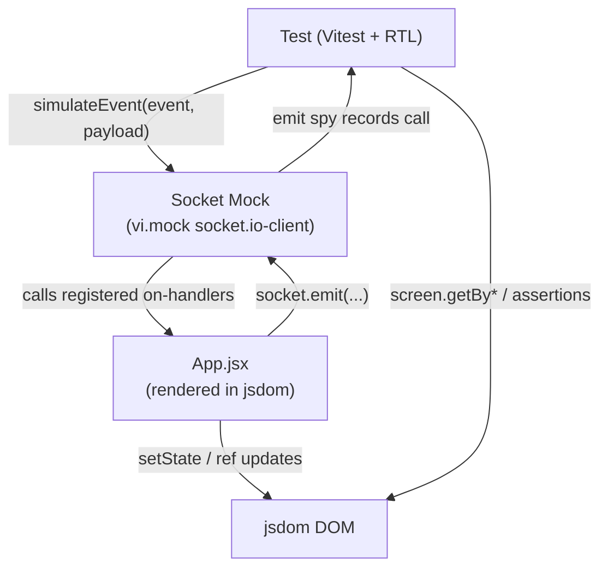

# Design Document: gameplay-integration-tests

## Overview

This design covers the integration test suite for the multiplayer Memory game's gameplay logic in `App.jsx`. The tests target a specific class of bugs that arise from React's stale closure model interacting with socket.io event handlers: refs that are read inside closures registered at mount time may not reflect state that changed after mount.

The primary subjects under test are:

- **Socket mock infrastructure** — a `vi.mock` of `socket.io-client` that lets tests simulate server events and assert on client emissions without a real server.
- **`gameStarted` handler** — verifies that `myPlayerIndexRef.current` is set to the correct player index (stale closure bug), and that all game state is initialised correctly.
- **`turnCard` function** — verifies turn ownership enforcement and that already-selected/matched cards are ignored.
- **`cardSelected` emission** — verifies the payload shape emitted to the server.
- **`emojisDataRef` round-trip** — verifies that the ref and the React state are consistent after `gameStarted`, so card lookups by index never return stale data.

The test file will be `gameplay-integration-tests.test.jsx` at the workspace root, following the same naming convention as the existing `memory-game-image-fix.preservation.test.jsx`.

---

## Architecture

The test suite renders `App` in a jsdom environment via `@testing-library/react`. All network I/O is eliminated by mocking `socket.io-client` at the module level with `vi.mock`. The mock captures `socket.on` registrations and exposes a `simulateEvent` helper so tests can fire server events synchronously.



The key insight is that `App.jsx` calls `io()` at module scope (outside the component). The mock must intercept this call and return a fake socket before the module is evaluated. `vi.mock` hoisting guarantees this.

---

## Components and Interfaces

### Socket Mock

The mock lives inside the `vi.mock('socket.io-client', ...)` factory. It is the central test infrastructure piece.

```
socketMock
  .on(event, handler)   — registers a handler; stored in listeners map
  .off(event, handler)  — removes a handler
  .emit(event, payload) — spy; records the call (does NOT invoke server logic)
  .simulateEvent(event, payload) — calls all registered handlers for event
```

`simulateEvent` is not a real socket.io API — it is a test-only helper attached to the mock object so tests can trigger server-to-client events.

The mock is reset between tests: `emit` spy is cleared, and the `listeners` map is wiped. This is done in `beforeEach`.

### App Component (under test)

`App` is rendered with `render(<App />)` from `@testing-library/react`. No props are needed — all state is internal.

To drive the component into the game-playing state, tests must simulate the sequence of socket events the server would normally send:

1. `roomUpdate` — populates `connectedPlayers` and `connectedPlayersRef`, sets `isWaitingRoom: true`.
2. `gameStarted` — sets `emojisData`, `emojisDataRef.current`, `myPlayerIndexRef.current`, `currentPlayer`, clears selections, sets `isGameOn: true`.

### Ref Exposure Strategy

`myPlayerIndexRef` and `emojisDataRef` are internal refs. Tests need to read them. The chosen approach is a **thin wrapper component** rendered in tests that renders `<App />` and exposes refs via `data-testid` attributes on hidden spans updated via `useEffect`. This avoids modifying `App.jsx` itself.

Alternatively, since `myPlayerIndexRef.current` drives observable DOM behaviour (whether `cardSelected` is emitted), most assertions can be made indirectly through DOM/emit assertions rather than reading the ref directly. Both approaches are described in the Testing Strategy.

---

## Data Models

### Card Object (as received in `gameStarted`)

```js
{
  id: number,        // original card id
  name: string,      // display name / lookup key
  type: 'emoji' | 'image',
  symbol?: string,   // present when type === 'emoji'
  image?: string,    // present when type === 'image'
}
```

After processing in the `gameStarted` handler, each card also gets:

```js
{
  ...card,
  id: index,         // overwritten with grid position index
}
```

### Minimal `gameStarted` Payload (used in tests)

```js
{
  gameConfig: { category: 'animals-and-nature', number: 4, players: '2' },
  gameCards: [
    { id: 0, name: 'cat',  type: 'emoji', symbol: '&#128049;' },
    { id: 1, name: 'dog',  type: 'emoji', symbol: '&#128054;' },
    { id: 0, name: 'cat',  type: 'emoji', symbol: '&#128049;' },
    { id: 1, name: 'dog',  type: 'emoji', symbol: '&#128054;' },
  ]
}
```

### `roomUpdate` Payload (used to seed `connectedPlayers`)

```js
{
  code: 'ABCD',
  players: [
    { id: 'socket-id-1', name: 'Alice', isHost: true },
    { id: 'socket-id-2', name: 'Bob',   isHost: false },
  ]
}
```

### `cardSelected` Emission Payload (asserted in tests)

```js
{
  roomCode: string,
  cardIndex: number,
  playerName: string,
}
```

### `updateGameState` Payload (used in round-trip test)

```js
{
  currentPlayer: number,
  allSelectedCards: number[],  // array of card indices
}
```

---
